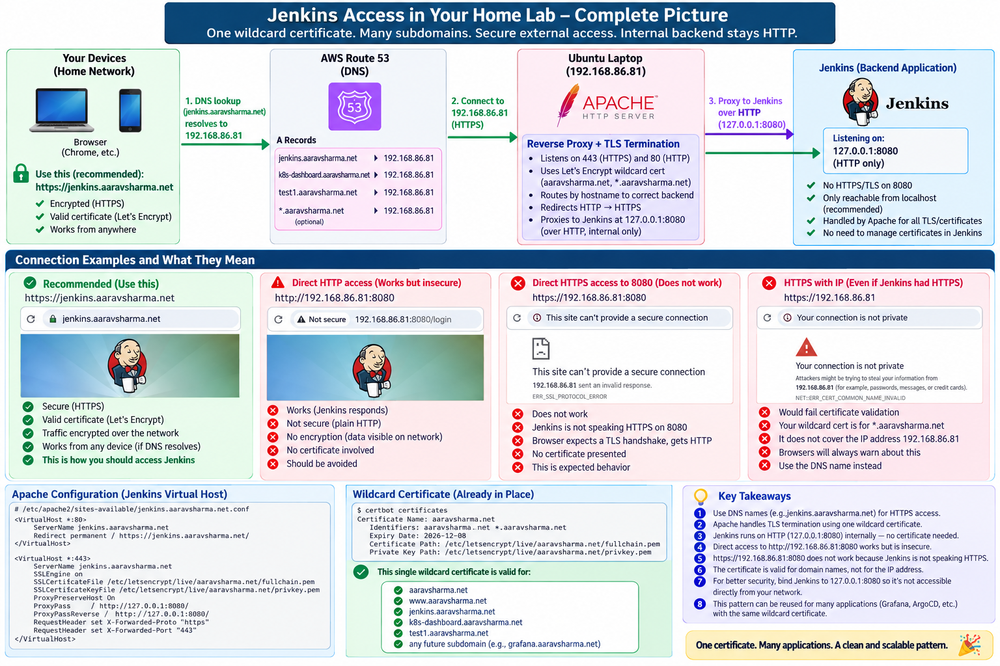
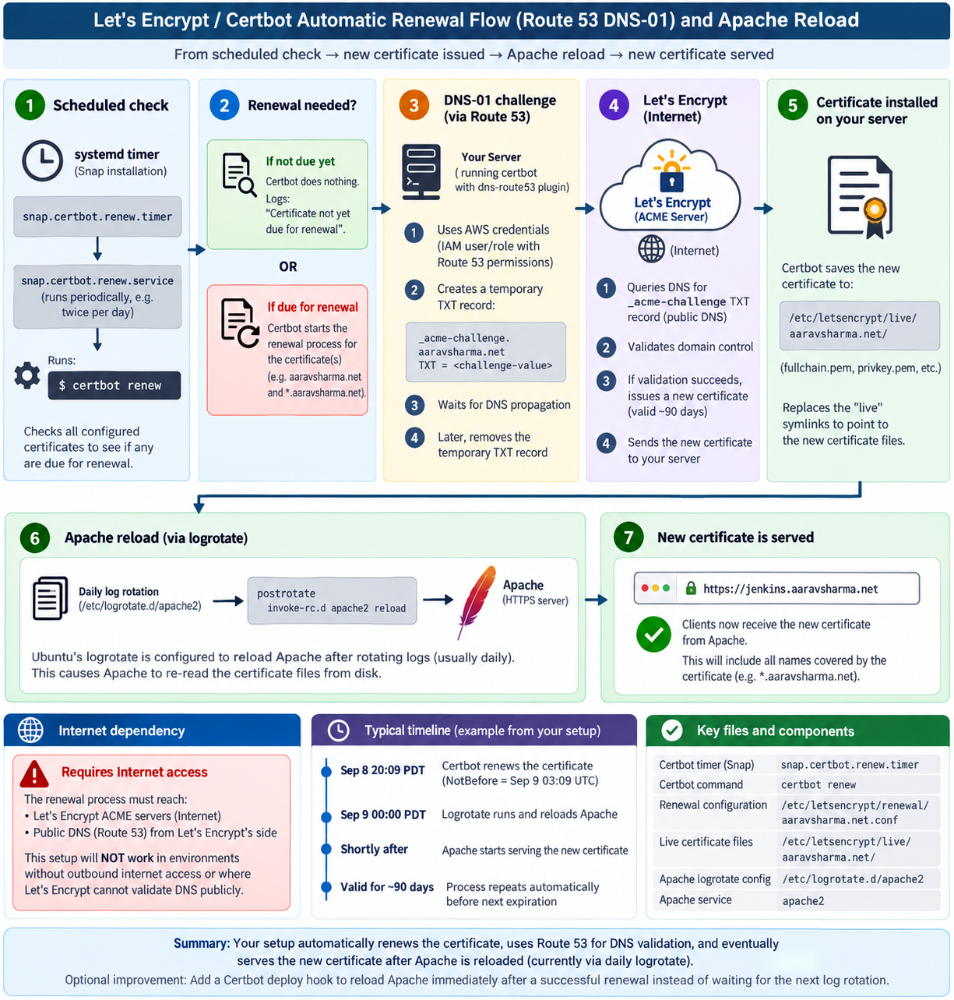
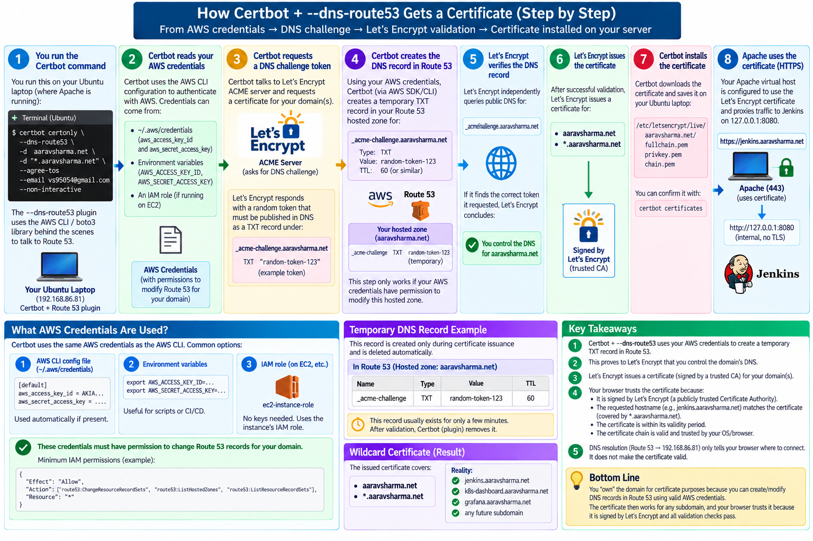

# Practical Guide: Let's Encrypt, Certbot, Route 53, Apache, and Jenkins

This companion guide is the **visual/practical walkthrough** for the
certificate setup documented in the main README. The diagrams follow the
complete lifecycle: how applications are exposed through Apache, how DNS
and TLS have different responsibilities, how Certbot proves domain
control, and how certificates are renewed automatically.

> **Suggested reading order:** Start with the application architecture,
> then understand DNS vs. certificate trust, follow initial certificate
> issuance, and finish with automatic renewal.

------------------------------------------------------------------------

## 1. Subdomains → Apache → Different Applications


This is the overall **application-access architecture**. Route 53 maps
each application hostname to the Ubuntu server, while Apache listens on
HTTPS/443, terminates TLS using the wildcard certificate, and
reverse-proxies each hostname to the appropriate backend service. The
backend applications can remain HTTP-only because Apache provides the
external TLS boundary.

**Key idea:** Route 53 knows the hostname and IP address; Apache knows
which backend application and port should receive the request.

------------------------------------------------------------------------

## 2. Jenkins Access in the Home Lab --- Complete Picture



This diagram applies the architecture specifically to Jenkins. Users
access `https://jenkins.aaravsharma.net`, Apache presents the trusted
wildcard certificate and terminates TLS, then proxies the request
internally to Jenkins over HTTP on port `8080`. It also illustrates why
direct HTTP access works but is insecure, and why sending HTTPS directly
to an HTTP-only Jenkins port does not work.

**Key idea:** Jenkins does not need to manage the public certificate
when Apache is the TLS termination point.

------------------------------------------------------------------------

## 3. DNS Resolution and Certificate Trust Are Different Things



This diagram separates two concepts that are easy to mix together. DNS
answers **"Where is the server?"**, while the certificate/TLS process
answers **"Can I trust the identity presented for this hostname?"** A
Route 53 record pointing `jenkins.aaravsharma.net` to an IP address does
not by itself make the HTTPS connection trusted.

**Key idea:** DNS locates the service; the certificate authenticates the
hostname and enables trusted encrypted communication.

------------------------------------------------------------------------

## 4. How Certbot + `--dns-route53` Gets the Certificate



This is the **initial certificate-issuance workflow**. Certbot uses AWS
credentials and the Route 53 plugin to create a temporary
`_acme-challenge` TXT record; Let's Encrypt queries public DNS and uses
that record to verify control of the domain. After successful
validation, Let's Encrypt issues the certificate and Certbot stores it
under `/etc/letsencrypt/live/...`.

**Key idea:** The DNS-01 challenge proves control of the domain's DNS.
For a wildcard certificate such as `*.aaravsharma.net`, this allows many
current and future one-level subdomains to use the same certificate.

> **Internet dependency:** The Certbot host must be able to communicate
> with the Let's Encrypt ACME service, and Let's Encrypt must be able to
> query the domain's public DNS. This workflow is therefore not directly
> applicable to a fully isolated environment without Internet
> connectivity.

------------------------------------------------------------------------

## 5. Automatic Certificate Renewal and Apache Reload


After initial issuance, Certbot's Snap-installed systemd timer
periodically checks whether the certificate should be renewed. When
renewal is required, Certbot repeats the Route 53 DNS-01 validation with
Let's Encrypt and installs the new certificate files. Apache must
subsequently reload to reread those files; in this lab, Ubuntu's daily
Apache `logrotate` configuration already performs that reload.

**Key idea:** Certificate renewal and Apache certificate loading are
related but separate events. A Certbot deploy hook can optionally reload
Apache immediately after successful renewal instead of waiting for
another reload mechanism such as log rotation.

------------------------------------------------------------------------

## Complete Mental Model

The five diagrams together describe one end-to-end system:

``` text
                    CERTIFICATE ISSUANCE / RENEWAL

 Certbot
    |
    | AWS credentials + Route 53 permissions
    v
 Route 53  <---- temporary _acme-challenge TXT record
    ^
    |
    | public DNS query
    |
 Let's Encrypt (Internet)
    |
    | DNS control successfully validated
    v
 Certificate issued / renewed
    |
    v
 /etc/letsencrypt/live/aaravsharma.net/
    |
    | Apache reload
    v
 Apache uses the current certificate


                         NORMAL USER ACCESS

 Browser
    |
    | DNS lookup
    v
 Route 53
    |
    | jenkins.aaravsharma.net -> Ubuntu IP
    v
 Apache :443
    |
    | TLS terminates here
    | wildcard certificate presented here
    |
    | reverse proxy over HTTP
    v
 Jenkins :8080
```

There are therefore **two distinct flows** to remember:

1.  **Certificate lifecycle:** Certbot → Route 53 DNS-01 → Let's Encrypt
    → certificate → Apache reload.
2.  **Normal application traffic:** Browser → Route 53 DNS lookup →
    Apache HTTPS → backend application.

Let's Encrypt is involved when certificates are **issued or renewed**.
It is **not in the request path** every time a user opens Jenkins or
another application.

------------------------------------------------------------------------

## Related Detailed Guide

For the complete command-by-command procedure, see:

➡️ **[Let's Encrypt / Certbot Detailed Setup Guide](README.md)**

The detailed guide covers:

- Certbot installation using Snap
- AWS / Route 53 permissions and validation
- Let's Encrypt wildcard certificate creation
- Apache HTTPS and reverse-proxy configuration
- Certificate inspection and validation
- Automatic certificate renewal
- Apache reload behavior
- Troubleshooting and security considerations

------------------------------------------------------------------------

## Bottom Line

``` text
Route 53 DNS       = Where should the client connect?
DNS-01 challenge   = Can Certbot prove control of the domain?
Let's Encrypt      = Can a trusted public CA issue the certificate?
Apache             = Where is TLS terminated and the certificate presented?
Backend app        = Where is the actual application running?
Certbot renewal    = How is the certificate kept current?
Apache reload      = How does Apache begin serving the renewed certificate?
```

Once these responsibilities are separated, the complete HTTPS
architecture becomes much easier to understand and troubleshoot.
